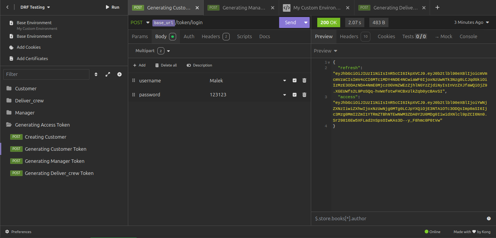
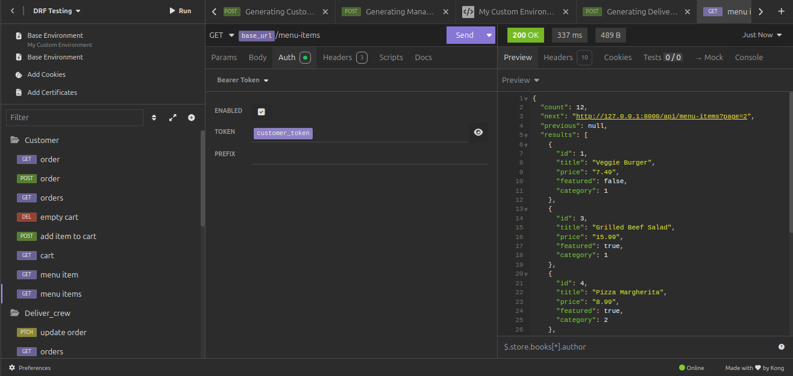
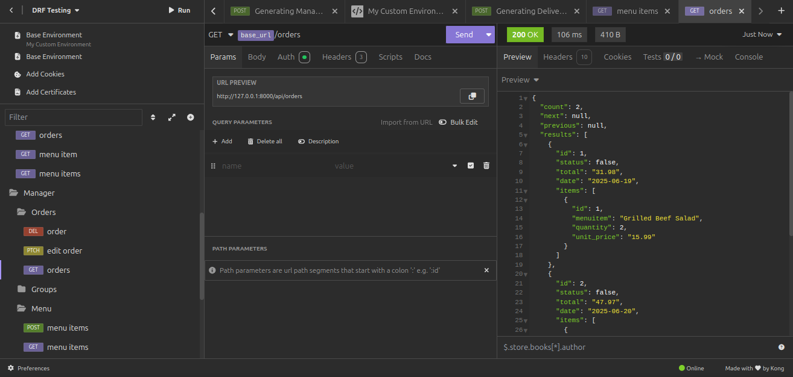

# E-commrece Django REST API
## Overview
Little Lemon API is a Django-based backend application featuring role-based user management and e-commerce functionality. It supports multiple user roles including Admin, Manager, Delivery Crew, and Customers. The project implements a custom user model and provides APIs for user registration, login, menu management, cart operations, and order processing.

---

## Features
- Custom user model with role support using `AbstractBaseUser`
- User registration and authentication via Djoser
- Role-based API permissions and functionality
- Models for Users, Menu Items, Cart, and Orders
- Orders API with automatic assignment of the logged-in user and cart conversion on POST
- Pagainiation, results filteration, throttling
- Tested API endpoints using Insomnia

---

## Technologies Used

- Python 3.12
- Django
- Django REST Framework (DRF)
- Djoser (for user authentication)
- Django Filter
- SQLite (default database)
- Insomnia (for API testing)

---

## Installation

1. Clone the repository:
   ```
   git clone https://github.com/MalekAldaas/e-commerce-api.git
   ```

2. use pipenv to install dependincies
   ```
   sudo apt-get install pipenv
   pipenv shell
   pipenv install
   ```

3. Apply migrations:
   ```
   cd LittleLemon/
   python manage.py makemigrations
   python manage.py migrate
   ```

5. Run the development server:
   ```
   python manage.py runserver
   ```

---

## Testing

API endpoints are tested using Insomnia.

### 🧪 Importing Tests

The `insomnia-tests/little-lemon-api-tests.insomnia.yaml` file contains all saved requests and test cases.

To import:

1. Open Insomnia.  
2. Click on the **Insomnia icon** → **Import**.  
3. Choose **"From File"**.  
4. Select `insomnia-tests/little-lemon-api-tests.insomnia.yaml`.  

---

### 🔑 Setting Up Environment Variables

You can find **"Generating Access Token"** folder containing requests to generate access tokens.

You need to use these requests to obtain access tokens and then replace the corresponding environment variables with the generated tokens for the API requests to work properly.

> **Note:** This ensures the requests use valid authentication tokens stored in environment variables like `{{customer_token}}`.


---

## Screenshots
### Creating Customer Access Token



### Customer List Menu Items



### Manager Lists Orders

---
